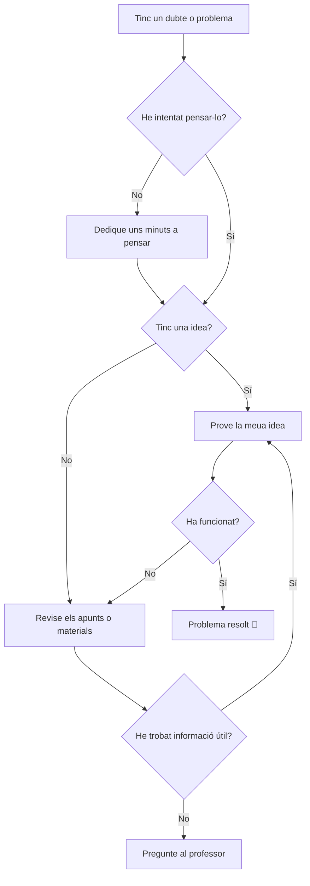

# Digitalització 4t ESO

Benvinguts a la web del curs 2026-2027. Aquesta us guiarà durant els pròxims mesos d'aprenentatge.

## Sitaucions d'aprenentatge

* **Desconnecta per Connectar**- Ús responsable de les pantalles, benestar digital i gestió del temps en línia.
* **Detectius de la Desinformació**- Verificació de fonts, fake news i pensament crític a internet.
* **Crea el teu Món Virtual**- Disseny i creació de continguts digitals interactius i multimèdia.
* **Dades que Parlen**- Recollida, anàlisi i visualització de dades amb eines digitals.
* **Programant Solucions**- Introducció a la programació i automatització de problemes quotidians.
* **La meua identitat digital**- Privacitat, ciberseguretat i reputació digital en xarxes i plataformes.

## Salutació

```py title="Hola món"
def hola():
    print("🌐 Hola món!")
    print("👋 Benvingut/da a la web de Digitalització de 4t d'ESO")
    print("💻 Preparat/da per aprendre tecnologia, programació i seguretat digital?")
```

## Dubtes

Diagrama sobre què fer quan tinc un dubte/problema:


