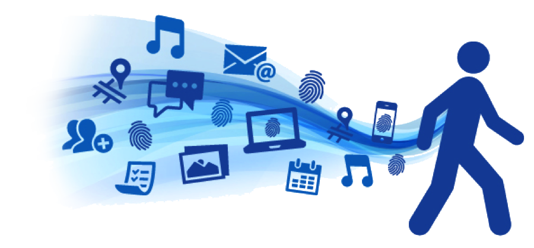

# Empremta digital

Imagina que algú et contacta a través d’Internet i et diu: “**Jo sé més sobre tu del que penses**”. Com et sentiries? El creuries?

## Què és i per què és important?

Quan naveguem per Internet i utilitzem plataformes en línia, deixem un **rastre de la nostra activitat digital**: l’historial de cerques, els vídeos que veiem, les publicacions que consultem o els “m’agrada” que donem. Aquesta informació, encara que sovint no en som conscients, forma part de la nostra **empremta digital**.

Què ocorreria si aquestes dades caigueren en mans equivocades? Podrien ser utilitzades per a manipular-nos, suplantar la nostra identitat o fins i tot posar en risc la nostra privacitat i seguretat. Per això, és molt important **ser conscients de la informació que compartim i de com gestionem la nostra presència en línia**.

## Definicions

> **Empremta digital**: És el rastre que deixes a Internet quan utilitzes xarxes socials, fas cerques o acceptes condicions.

> **Empremta digital voluntària**: Tota aquella informació que publiques, comentes o comparteixes.

> **Empremta digital involuntària**: Totes aquelles dades que els llocs webs recopilen de tu sense adonar-te (ubicació, clics, cookies, historial, etiquetes alienes, etc.).

